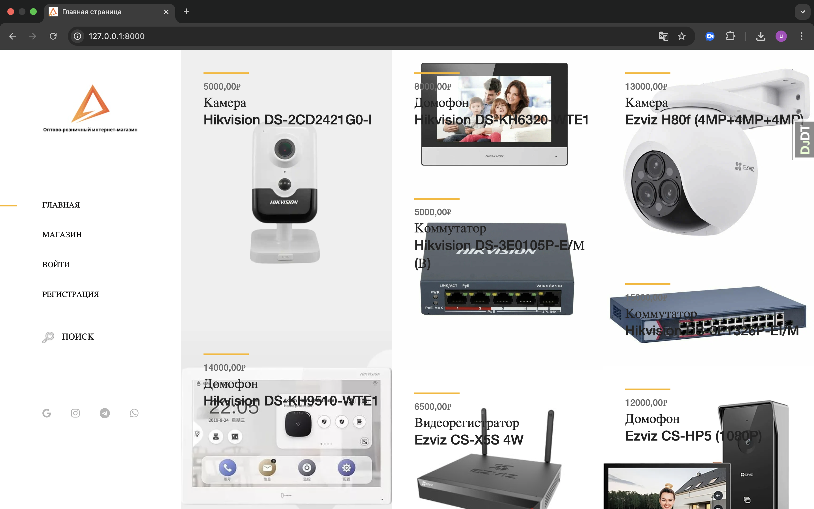
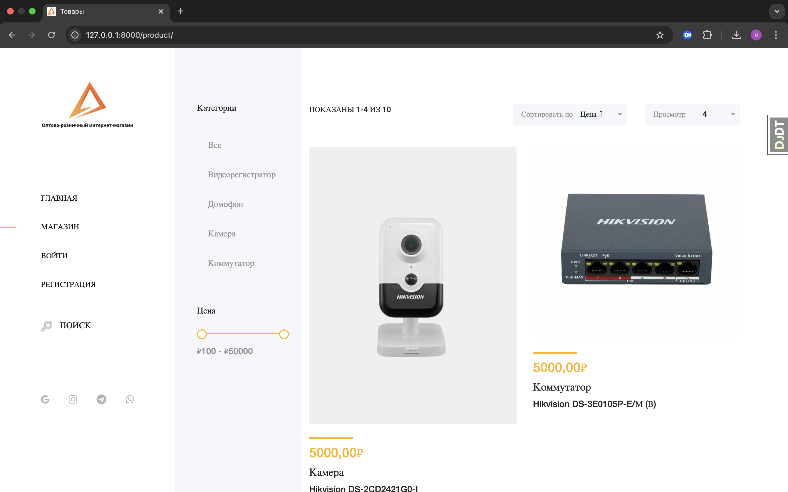
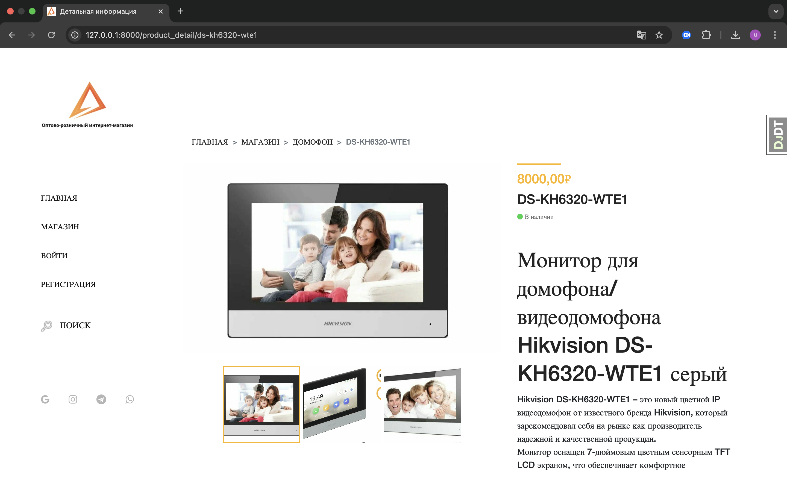

# Интернет-магазин

Веб-приложение для продажи оборудования видеонаблюдения, построенное на Django.

## 🚀 Функциональность

### Основные возможности
- **Каталог товаров** с категориями и фильтрацией
- **Поиск товаров** по названию и описанию
- **Система пользователей** с регистрацией и авторизацией
- **Подписка на email-рассылку** с автоматическими уведомлениями
- **Административная панель** для управления контентом
- **Адаптивный дизайн** для мобильных устройств

### Для пользователей
- 📱 Регистрация и авторизация (включая OAuth через Google)
- 👤 Личный кабинет с редактированием профиля
- 🔍 Поиск и фильтрация товаров
- 📧 Подписка на новости и акции
- 📱 Мобильная версия сайта

### Для администраторов
- ⚙️ Полный CRUD для товаров, категорий, брендов
- 📊 Управление пользователями
- 📧 Массовая рассылка подписчикам
- 🔒 Защищенный доступ к админ-панели

## 🛠 Технологический стек

### Backend
- **Django** - основной фреймворк
- **Django ORM** - работа с базой данных
- **Celery** - асинхронные задачи
- **Redis** - брокер сообщений
- **PostgreSQL** - база данных
- **MemcacheCache** - кэширование

### Frontend
- **HTML5/CSS3** - верстка
- **JavaScript/jQuery** - интерактивность
- **Bootstrap** - адаптивная сетка
- **JQuery UI** - слайдеры и взаимодействия

### Безопасность
- **reCAPTCHA** - защита от ботов
- **Django Auth** - система аутентификации
- **CSRF protection** - защита форм

### Дополнительно
- **Django Templates** - шаблонизатор
- **Pillow** - работа с изображениями
- **Celery Beat** - периодические задачи


## 🚀 Установка и запуск

### Предварительные требования
- Python 3.8+
- Redis
- PostgreSQL (опционально)
- Celery
- MemcacheCache

### Шаги установки

**Клонирование репозитория**
```bash
git clone https://github.com/Ula19/OnlineStore.git
cd MyStoreV2
```
## Создание виртуального окружения
```bash
python -m venv venv
source venv/bin/activate  # Linux/Mac
# или
venv\Scripts\activate     # Windows
```
## Установка зависимостей
```bash
pip install -r requirements.txt
```
## Настройка окружения
Создайте файл .env и настройте:
```python
SECRET_KEY=your-secret-key
DEBUG=True
DATABASES_NAME=your-db-name
DATABASES_USER=your-db-user
DATABASES_PASSWORD=your-db-password
EMAIL_HOST_USER=your-email
EMAIL_HOST_PASSWORD=your-password
SOCIAL_AUTH_GOOGLE_OAUTH2_KEY=your-google-oauth2-key
SOCIAL_AUTH_GOOGLE_OAUTH2_SECRET=your-google-oauth2-secret
RECAPTCHA_PUBLIC_KEY=your-recaptcha-public
RECAPTCHA_PRIVATE_KEY=your-recaptcha-private
```
## Миграции базы данных
```bash
python manage.py makemigrations
python manage.py migrate
```
## Создание суперпользователя
```bash
python manage.py createsuperuser
```
## Загрузка данных (дефолтные данные товаров)
```bash
python -Xutf8 manage.py loaddata mysite_data.json
```
## Запуск Redis
```bash
redis-server
```
## Запуск Celery worker
```bash
celery -A MyStoreV2 worker --loglevel=info
```
## Запуск Celery beat (для периодических задач)
```bash
celery -A MyStoreV2 beat --loglevel=info
```
## Запуск MemcacheCache
```bash
memcached -p 11211:11211 memcached -m 64
```
## 📧 Настройка email-рассылок
Проект использует Celery для асинхронной отправки email:
- Еженедельные рассылки с акционными товарами
- Уведомления о подписке

### Периодические задачи
Воскресенье в 12:00 - рассылка подписчикам с товарами со скидками

## 🔧 Администрирование
Доступ к админ-панели: /admin/
- Управление товарами, категориями, брендами
- Просмотр подписчиков
- Управление пользователями

## 🎨 Особенности интерфейса

### Главная страница

- Сетка товаров с hover-эффектами
- Быстрый просмотр цены и категории
- Адаптивная верстка

### Каталог товаров

- Фильтрация по категориям
- Сортировка по цене, названию, количеству
- Слайдер для фильтрации по цене
- Пагинация

### Детали товара

- Галерея изображений
- Подробное описание с HTML-форматированием
- Индикатор наличия
- Хлебные крошки

## 🔒 Безопасность
- CSRF защита всех форм
- reCAPTCHA на формах регистрации и входа
- Хэширование паролей
- Валидация загружаемых файлов

## 📈 Производительность
- Кэширование запросов к базе данных
- Оптимизированные SQL-запросы через select_related
- Асинхронная отправка email через Celery


## 🤝 Вклад в проект
Для внесения изменений:
- Форкните репозиторий
- Создайте feature-ветку
- Внесите изменения
- Создайте Pull Request

## 📞 Поддержка
По вопросам работы проекта обращайтесь:
- [Telegram](https://t.me/@great_85_76_65)


# Проект находится в активной разработке. Функциональность может расширяться.
